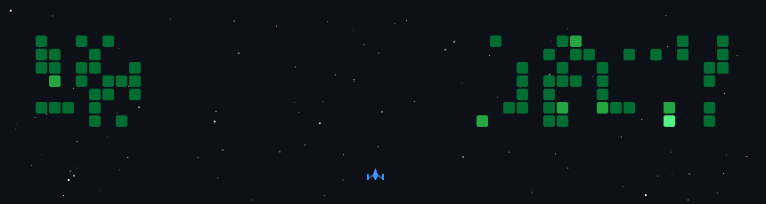

  

  
  
  
  
  

  
  
  
  

  
  
  
  

---

## 🚀 Contribution Game

---

## 2. About Me

I am a Front-End Developer and Computer Engineering student, focused on building responsive, intuitive, and high-performance web and mobile interfaces. I work with Angular, TypeScript, and Ionic to develop hybrid applications, combining UI/UX best practices with a scalable and reusable component architecture.

Day to day, I work with REST API integration and reactive programming using RxJS, always aiming for clean, performant, and maintainable code. Beyond Front-End, I am specializing in Full-Stack Java development, expanding my understanding of system architecture and back-end so I can propose more complete solutions aligned with business needs.

My path also includes data science: at the Brain innovation lab, I developed predictive models with Python and Machine Learning, strengthening my analytical skills and problem-solving mindset. Today, I am looking for opportunities as a Front-End or Full-Stack Developer (Web or Mobile), in teams that value continuous learning, collaboration, and real impact through technology.

📍 Sorocaba, São Paulo, Brazil

---

## 3. Tech Stack

### Languages

  
  
  

### Frontend & Mobile

  
  
  
  
  
  

### Tools & Practices

  
  
  
  
  
  

---

## 4. Featured Project

<b>🚂 Trilho (Routine / Productivity App)</b>

### Personal Product — In Progress
A routine and productivity app built from a real need: organizing vacation days during college break. Focused on a clear agenda, progress stats, and gamification.

| Dimension | Details |
| :--- | :--- |
| **Concept** | Personal routine tracker with a customizable profile and day agenda |
| **Gamification** | Animated train that reflects daily completion status (on time vs delayed) |
| **Status** | In progress — not a final release yet |
| **Focus** | Product design, UX, and front-end experience |

---

## 5. Experience

### Freelancer — Front-End Developer
**Caash Fácil** · Freelance | *Apr 2025 – Present* · Remote

Autonomous Front-End Developer on the Caash Fácil project, responsible for the full development cycle of a hybrid Web and Mobile application — from architecture to app store deployment.

* **Architecture & Development:** Built responsive, high-performance interfaces with Angular, TypeScript, and Ionic, using a scalable and reusable component architecture.
* **Data Integration:** Efficient REST API consumption and asynchronous state management with RxJS and reactive programming.
* **Mobile & Builds:** Packaged the web app into native apps via Capacitor, with multiplatform builds and deployment for Android and iOS (via Xcode).
* **UI/UX:** Applied usability and user-flow best practices to improve the final experience.
* **Process & Autonomy:** Independently managed the full cycle — from planning to deploy — using GitHub for versioning and Jira for task management, following agile methodology.
* **Skills:** `Angular` `TypeScript` `Ionic` `Capacitor` `RxJS` `REST APIs` `UI/UX` `GitHub` `Jira`

### Voluntary Internship — Brain
**IP Facens | Instituto de Pesquisas** · Internship | *Apr 2024 – Aug 2024* · Hybrid · Sorocaba, SP

Worked at the Brain innovation lab (Facens), applying Data Science and Machine Learning techniques to practical problems.

* **Modeling:** Developed and implemented regression and predictive models using Python.
* **Data:** Performed exploratory analysis, cleaning, and processing; applied Machine Learning algorithms to practical datasets.
* **Statistics & Visualization:** Used statistical techniques and data visualization tools to support decision-making.
* **Engineering & Documentation:** Versioned code with Git and produced detailed technical documentation for AI projects.
* **Skills:** `Python` `Machine Learning` `Data Science` `Git` `Problem Solving`

---

## 6. Education

### Centro Universitário Facens
**Bachelor's in Computer Engineering** · *Expected graduation: late 2027*

### EBAC
**Full Stack Java Development** · *In progress · Expected completion: late 2027*

---

## 7. GitHub Analytics

  <table border="0">
    <tr>
      <td>
        
      </td>
      <td>
        
      </td>
    </tr>
  </table>
   
  

